If you want to test out neuRLcar, download it here: https://bakkesplugins.com/plugin/704
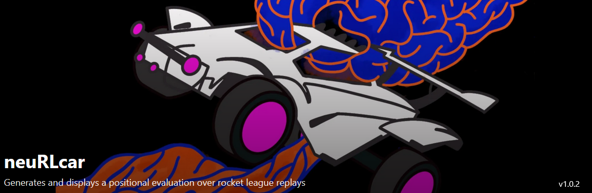

---

# Abstract

Machine learning techniques have proven to be an effective method of improving human understanding of games such as chess and Go, among others.  Algorithms (such as the chess engine Stockfish) that take in the totality of a gamestate and output a judgement of which side is winning in a game, and by how much, are called positional evaluation engines. Here, I've created a unique Rocket League (RL) positional evaluation engine which I call neuRLcar. The engine is trained on over 100,000 RL replay files, and uses a graph-like attention based neural network architecture to generate its evaluations. The engine takes a snapshot of the RL gamestate as input, and outputs a binary prediction on whether it predicts Blue or Orange is going to score next. I've also created a plugin in BakkesMod to display this positional evaluation as a real time overlay over the game's replay system. The engine works only to evaluate RL replays, it cannot work on live games, which prevents any potential for abuse and cheating. Overall, neuRLcar should prove an interesting and effective tool for Rocket League players looking to analyze and improve their gameplay.

---

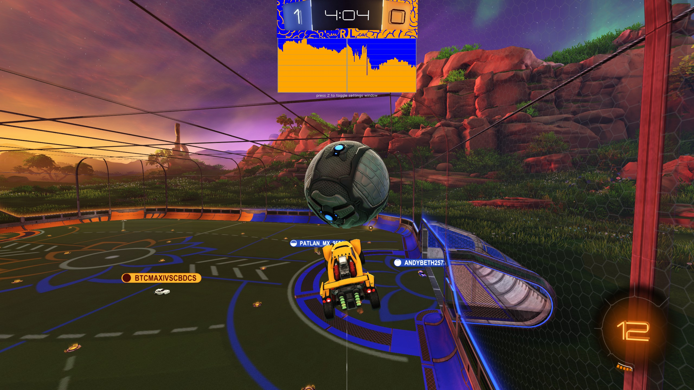
***the neuRLcar evaluation display rendered via BakkesMod plugin over a replay.***

---

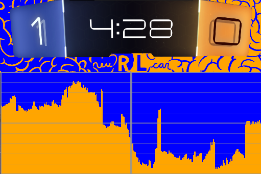
***The neuRLcar positional evaluation main display.** The evaluation of the current physics frame in the replay is indicated by the central grey bar. Past evaluations are to the left, and future evaluations are to the right. The display scrolls along as the replay is played.*

---

# Background

I was originally inspired to create neuRLcar while examining the chess games played by AlphaZero's famous match against Stockfish. In the match, AlphaZero displayed its superior understanding of long term positional advantages.  In many games, there exist two conceptual levels of gameplay understanding: "macro" play and "micro" play. Examples of macro play include positional/pawn play in chess, economy in Counter-Strike, and boost management and rotations in Rocket League. Examples of micro play include tactical sequences and material considerations in chess, aim in Counter-Strike, and mechanical proficiency and car control in Rocket League.  As a long time Rocket League player, I began wondering how well machine learning could understand the positional nuances of RL, so I set out to create what would eventually become neuRLcar.

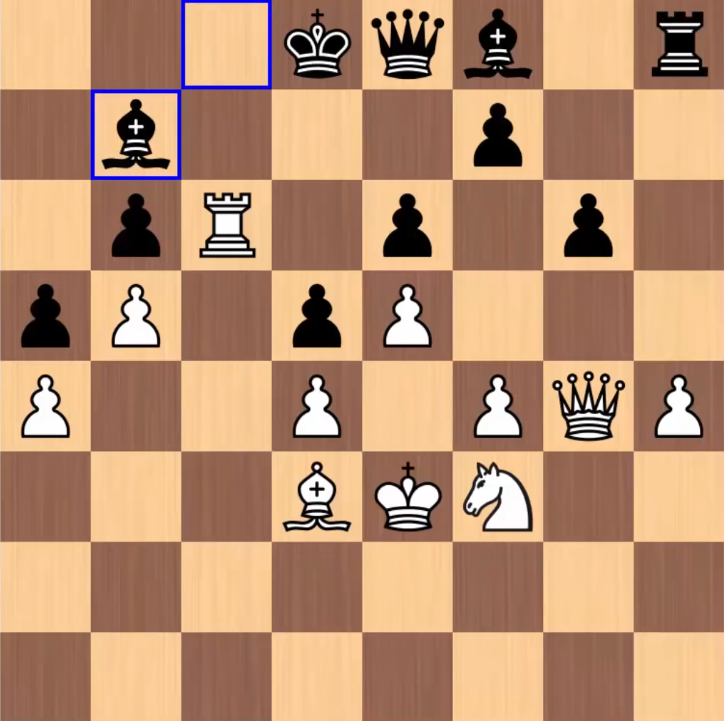
***A position from the now infamous 2017 AlphaZero Stockfish 8 match.** In this position, AlphaZero (white pieces) demonstrates its superior understanding of long term positional advantages. Stockfish's light-squared bishop is entombed by the game's pawn structure, allowing AlphaZero to play the game as if it's up a bishop.*

---

# Rocket League as a Series of Small Games

Rocket League is a physics based car soccer game that is played in two teams (Orange or Blue) of one, two, or three players each. The objective of the game is to have more goals than the other team at the end of 5 minutes. Goals are always worth one point each. If the score is even at the end of the game, an untimed sudden death Overtime is played, where the first team to score a goal is the winner. At the beginning of the game, and after goals are scored during the game, the ball is reset to the center of the arena and players are reset to their respective sides of the arena.

Rocket League is a physics based game. The cars and ball interact with each other through the rules of the physics of the game universe. This is calculated using a physics engine, which iterates 120 times per second. In a way, one can think of RL as a turn-based game. Only a single set of inputs can be registered by each player every 1/120th of a second. The most fundamental aspect of the game is its physics frames, which define the position, velocities, rotational velocities, and rotational orientation of the ball and cars/players for each frame. So, a positional evaluator needs to take in the gamut of the physics state of the game on every frame in order to give its output.

Another important thing to realize when creating a positional evaluator for this game is that the 5 minute clock is almost completely arbitrary. The only time when the clock matters for gameplay is when the clock is at zero, in which case the game stays alive until the ball touches the ground. This is the only time when the clock impacts gameplay. When the clock is ignored, Rocket League can be understood not a single 5 minute game, but as a series of small games from kickoff to a goal being scored, where either Blue or Orange win/score.

In order to train the positional evaluator, I accumulated a dataset of over 100,000 replays of the highest level Rocket League gameplay using publicly available replay hosting sites and then divided those replays into the kickoff->goal "subgames" and labelled each physics frame of those subgames with "who scores next".

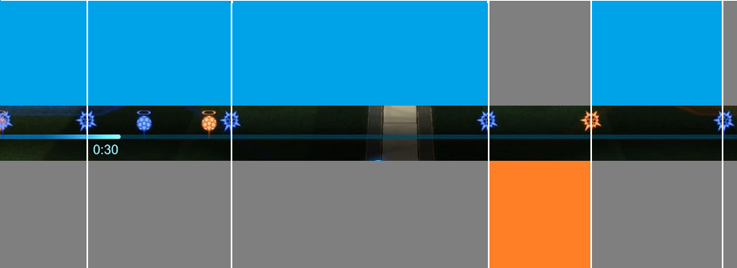
***Conceptualizing Rocket League as a series of small games.** This is a snippet of a Rocket League replay timeline where 5 goals were scored. The physics frames of the replay were labelled as either blue or orange scoring next. Blue scored goals 1, 2, 3, and 5, Orange scored goal 4.

---

# Faithfully Capturing the Full Game State

In addition to the physics information, there are a few "resources" and timers in the game that need to be kept track of in order to capture the totality of the Rocket League gamestate. The primary resource in the game is boost. Players have a "tank" of up to 100 boost (0-100 is displayed in the game UI, in reality this value is 0-255). Players spend this boost to propel themselves in the direction their car is facing, allowing players to speed up if they're driving on the ground, or to fly if their car is in the air and pointed upwards.

Another more subtle resource players have access to is the ability to jump. There are a number of constraints around the jumping system in this game. First off, there are two types of jumps: single jumps and double jumps/dodges. Single jumps happen when the player's car is grounded, i.e. at least three of four wheels of the car are touching a surface. The player gets an impulse of momentum off of that surface when pressing the jump button, and can extend that momentum (i.e. jump higher) by holding in the jump button for up to 0.2 seconds, or 24 frames. So, in order to capture the full gamestate of any given random RL physics frame, we need to keep track of how many frames the player has left to hold and extend his single jump. I call this the "jump 1 held timer".

Once the player has expended his single jump, he now has access to a second jump. The second jump times out 1.2 seconds after the single jump is released ("jump 2 expiration timer"). Players can choose to use their second jump to generate another similar momentum impulse to the single jump (i.e. towards the top of their car, wherever it's facing), or a stronger momentum impulse called a "dodge", which flips the car towards a direction and gives it a momentum impulse (e.g., the player can front flip in order to get forward momentum going). Once the player has expended his second jump, he can't jump again unless three of four wheels touch the a surface (whether that surface be the ground, ceiling, wall, ball, or even other players) So, we need to keep track of whether jump 2 is available or not. Notably, if a player doesn't use his single jump to get into the air, the 1.2 second "jump 2 expiration timer" never starts, so we have to keep track of that as well. 

---

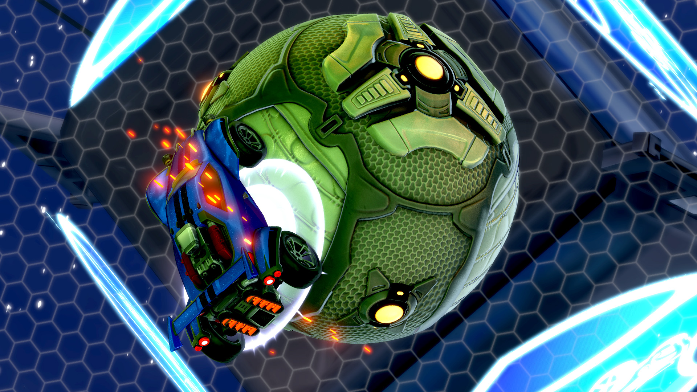
***Rocket League has recently updated the game to show the player a flip reset indicator when they successfully reset their flip on the ball or other players.***

---

In order to fully keep track of the players' jump statuses, I had to check every single frame whether their wheel hitboxes were touching any surface or player. This required drawing the mesh and checking for collisions of the wheel hitboxes every single frame in order to generate my training data.

Another timer to keep track of is the demolition timer. When a player is going full speed and hits an opposing player, the player's car is destroyed and reset back to one of four locations in his own half after a 3 second timeout. 

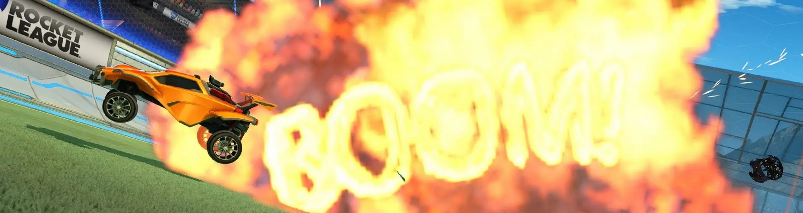

Finally, the hitbox of each player must be accounted for. There are a finite number of hitbox archetypes that cars in Rocket League are assigned to. These hitbox have different sizes, shapes and turning radii. 

# Training and Designing the Model

With a dataset consisting of millions of physics frames labelled "who scores next", I began training the model. I started with a simple MLP consisting of a physics frame as input, and a binary prediction as output. As the three gamemodes: 1v1 (duel), 2v2 (doubles), and 3v3 (standard) had different numbers of inputs because of their different number of players, I trained three separate models, one for each game mode. This worked decently, but I ran into a few problems.

First, 1v1 was much easier to train than the other gamemodes due to the smaller size of the model. Additionally, 1v1 is a much more polarized gamemode. By "polarized", I mean that there are less ambiguous circumstances that happen in a 1v1 game compared to a 2v2 or 3v3 game. In 1v1, if the defender is beat, the net is simply wide open, and a goal is inevitable. In 2v2 and 3v3, there are backup defenders and attackers, and in general in these modes, less goals are scored, which dilutes the training data's potency at informing the model which states are good or bad or even. This polarization of the 1v1 gamemode made it so the model learned much more efficiently in 1v1, and while the 1v1 model looked pretty good overlaid onto RL replays, the 2v2 and 3v3 models had a hard time making confident guesses even when it was humanly obvious that a goal was inevitable.

I solved the problem of having to train three different models for the different gamemodes by using a masked model. I grouped the inputs into three categories: players, ball, and global. Then, I created a model that took 6 players (3v3) as input by default, and did attention between all the player input embeddings and the ball and global input embeddings, and then finally ran that output through an MLP to get the final binary prediction. This architecture's advantage is that I only needed to train a single model for all three gamemodes.

Additionally, to improve model performance I added a separate category of input embeddings alongside the player ball and global input embeddings that I call the "edge" input embeddings. Absolute positioning in RL compared to the coordinates of the field is critical, yes, but so are the relative positions and velocities between the players and ball. Although these relative inputs will be learned latently by the model, it is more efficient to explicitly give the model access to these values during training, since I already know they'll be of critical importance.

So, I computed relative position and velocity between all the dynamic "nodes" of input embeddings (up to 6 players and the ball). I call these dynamic<->dynamic edges. Then, I also computed what I call dynamic<->static edges, which are simply each dynamic node's relative position compared to important locations on the field, including the center of all 6 faces of the field (floor, ceiling, offensive backwall, defensive backwall, both sidewalls), and the center of all 4 edges of the goal's outline.

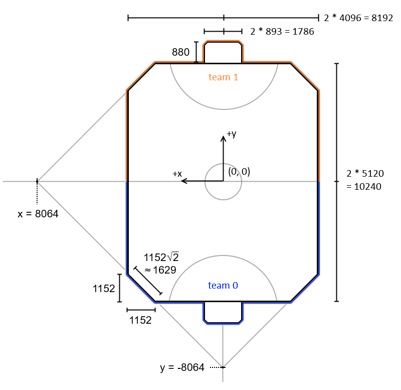
***RL field dimensions.** Rocket League's standard field keeps track of the x, y, and z positions of all players and the ball. Dimensions relative to the field are absolute dimensions. I also fed the model data about the relative dimensions of the players and ball relative to key spots on the field and each other. From: https://wiki.rlbot.org/v4/botmaking/useful-game-values/*

Another constraint the model should have is that it should yield the same prediction if the situation is reversed. So the network takes in as another input the inverted physics frame, with everything flipped around the X axis.

The network prediction $H(f)$ of the physics frame $f$ is constrained via the prediction of the inverted physics frame $H(f^{-1})$ during training such that:

$$
H(f) = 1 - H(f^{-1})
$$

and therefore

$$
H(f) + H(f^{-1}) = 1
$$

although only $H(f)$ is used in the final prediction.
 
 The segmented kickoff-goal labelled data harbors a lot of variability in the sizes of labelled stretches of play. Each segment can be as short as a few seconds or as long as an entire game if regulation ended in a 0-1 buzzer-beater. This variability dilutes the signal for training and yields more "timid" analysis from the model. Often, when training with the entirety of the labelled data the model failed to make confident guesses even when a goal was extremely obviously imminent. 
 
 Additional analysis of the quality of primitive positional evaluators always yielded graphs such as these:
 
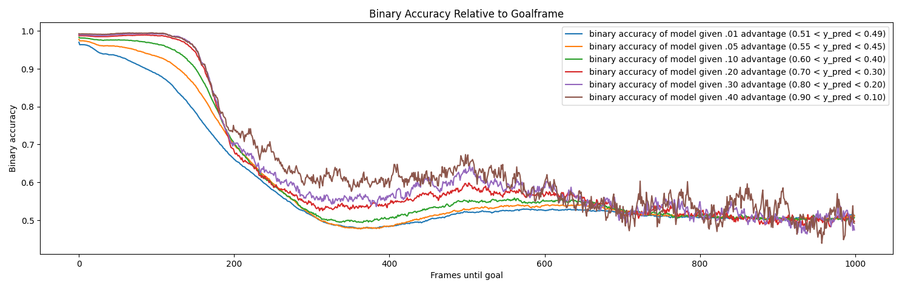
 ***Accuracy of a simple MLP model relative to goalframe.** The goalframe is the frame a goal is scored. Frames until goal (i.e. time until goal) is shown on the horizontal axis, and the binary accuracy of the evaluation is shown on the vertical axis. Different colored lines show different evaluation confidence thresholds. The model guesses a number in the range of 0 - 1, with 0 being an 100% confident guess for Orange, and 1 for Blue. For example, the blue line considers all evaluations above 0.51 and below 0.49, and assays their accuracy relative to who actually scored. Evaluations are considered accurate if the true value is above 0.51 and the correct label guess is 1, inaccurate if the correct  label guess is 0, and vice versa.
 

 Binary accuracy relative to goalframe here is how accurate the model's bias is relative to how far away the prediction frame is temporally from a goal. These analyses show that models are temporally myopic beyond a certain time threshold. Note that replays only record 30 frames per second, out of the 120 frames per second of live play, so here 300 frames is 10 seconds.
 
 There are a couple potential interpretations of this. One is that signal is washed out beyond a certain time threshold. In a long period of relatively-even-but-advantaged midfield play, for example, there exist a lot more situations that the model has to learn during training with a signal that is much more dilute and information-poor than cut-and-dry goalscoring situations.
 
 Another interpretation is that the models are telling us that there is no such thing as long term pressure in RL. This is a surprising and counterintuitive interpretation to anyone who has played the game at a relatively high level. To test this, I tried training the model while excluding physics frames that were more than 300 frames until a goal. These models failed to effectively learn altogether. (data not shown)
 
 Another interesting facet of the binary accuracy relative to goalframe graphs is that the models have a period of anti-prediction, where their biases are predicting the outcome of the play worse than a random guess. I understand this as a counterattacking signal. Often, when a team has an open net advantage, missing or failing to capitalize on that advantage will immediately concede a goal to a counterattack.
 
 Taking all of this into account, I decided to alter the training process in a few ways:
 
 First, I trained the model only on frames that were less than ten seconds until a goal. This prevents signal dilution by excluding the non-informative non-goalscoring plays. It's also a long enough time to capture counterattack periodicity. That is to say, goals scored via counterattack will likely include the physics frames of the original attack. This requires the model to differentiate between successful and unsuccessful attacks.

Second, I created a second binary prediction metric that I call "goal immanency". A fully connected layer at the head of the network distinct from the who scores next layer predicts whether a goal is within 90 frames, or 3 seconds, of being scored.

The final neuRLcar architecture looks like this:

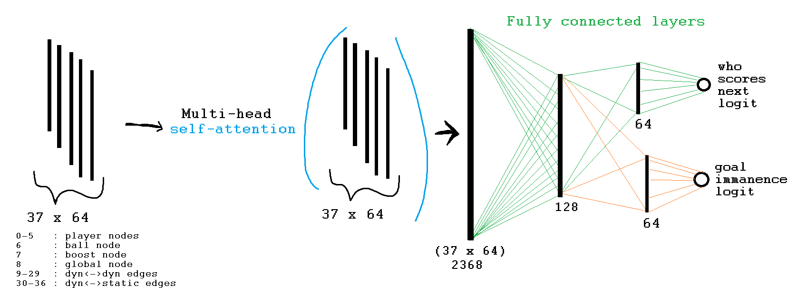
***neuRLcar architecture.** Groupings of raw input features ("nodes") and derived features ("edges") are embedded and attention is performed between all of these groups. Then, the attention result is fed into a simple MLP and two separate logit heads predict who_scores_next (0-1, orange-blue) as well as goal immanency (0-1, is this frame less than 90 frames (3s) to a goal?)

These two binary predictions are composed like so to give an evaluation that improves upon the raw who scores next prediction:
$$
e(g,wsn) = \operatorname{sign}(wsn)\cdot (g + |wsn| - g|wsn|)
$$

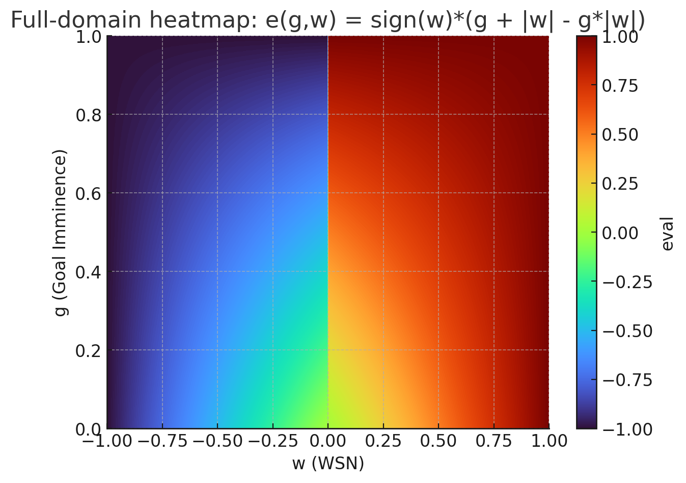
***WSN and goal immanence composition.**  This formula forces the model's evaluation to be more confident the more that it thinks a goal is imminent, while still respecting longer-term confident WSN guesses. This composed evaluation was used during training to compute and backpropagate the loss, and resulted in a MAE training improvement of 0.01 over WSN only evaluations. Subjectively, I think this composition allows the model to more easily identify missed scoring opportunities. Note that in this figure the evaluation ranges from -1 to 1 instead of 0-1, but this doesn't change the concept.*

---

# Results/Discussion

One of the main subjective features about watching the analysis of the model over replays is that the model very often inflects its evaluation upon players touching the ball. This makes sense given that who_scores_next models can't capture longer term positional advantages. Physics interactions in this game are effectively half-spheres (cars), repeatedly interacting with another sphere (ball), which is a very chaotic interaction -- even tiny variations in position at the time of each impact can yield large changes in the physics outcome of any given ball touch, and the ball is touched hundreds of times per game. Touches often happen in rapid succession during contested plays on the ball. In a case where two players are engaging in a simultaneous collision with the ball, not only does the model need to accurately predict the physical outcome of the play, but two out of three of the parties involved in the collision are sentient agents. The community calls these plays 50/50s, or 50s, representing the chaotic nature of the interaction. The inability to predict 50s outcomes is also diminished by the reduced time fidelity of replay files, 30fps vs the 120fps in-game. Other factors include hitbox type and wheel touches, which change the physics interactions between the car and ball.

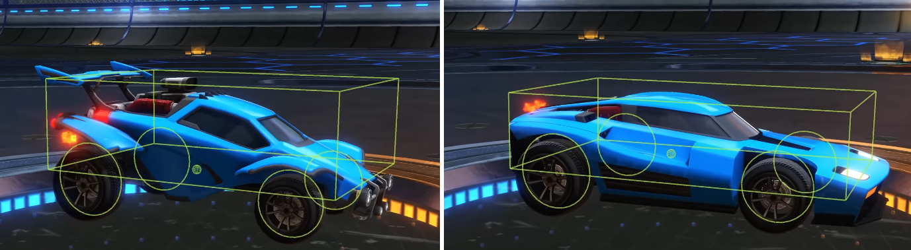
***Rocket League hitboxes.** Although these hitboxes are box-shaped, the force vector the ball applies on the car is applied from the center node (green dot in the middle of the car), which makes it so the cars are effectively half-"spherical"*

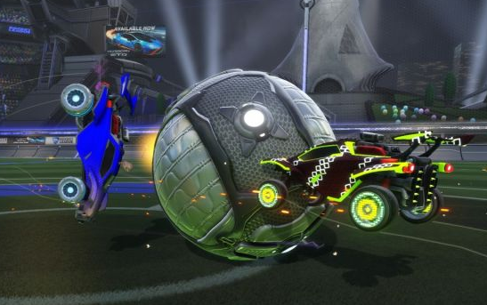
***Physics interactions in Rocket League are very chaotic.***

Despite these limitations, the model is still quite informative. I am a top 0.5% competitive player, and looking at the model over my own gameplay has allowed me to better understand which situations are good and bad, and even to identify situations where there exists a scoring opportunity that I wasn't aware of.  neuRLcar is a great tool for understanding and analyzing your games. Even the chaotic ball touch model evaluation inflections are quite informative since they latently encode the quality of just about every touch that occurred during the game.

The most surprising result of this project was learning just how tactical the game of Rocket League is. Maybe my model wasn't large enough or the dataset large enough, or maybe human gameplay is too imperfect to generate long term positional advantages, but it's surprising that neural learning approaches failed to identify a long-term advantage signal. This leaves the counterintuitive interpretation that Rocket League is a game of primarily mechanical skill, and that players looking to improve can focus even more on mechanical skill than improving game sense and positioning. Of course, mechanics, game sense, and positioning aren't mutually exclusive things, but mechanics are the potentiating factor. When a play or movement goes from mechanically impossible to possible, the consideration of what good positioning is changes along with it. For example, players capable of walldashing, which is a way to generate lots of speed on the wall without boost, improve their effective playing range without boost. The ability to perform this mechanic consistently changes the evaluation of their positioning quality in many situations compared to a player that can't walldash.

---

Huge thanks to my sister, who created the beautiful BakkesMod plugin scoreboard wrapper and the plugin header image.

I also want to extend a big thanks to the guys at the BakkesMod programming Discord server, the RLGym Discord server, and CantFly of ballchasing.com. 

Without these people, this project wouldn't have been possible.

---

If you want to test out neuRLcar, download the plugin here: https://bakkesplugins.com/plugin/704

Feedback, questions, and comments are welcome: neurlcar@gmail.com

